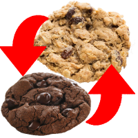

# Swap Cookies

## What it does

This extension swaps the cookies for the website open in the active tab.

This way, you can swap between two accounts for a website with a few clicks, and
without going through the process of logging out or opening a private browsing session
and logging in again.

It applies to all open tabs for that website (and that share the same cookie store,
e.g. private windows are not affected by what happens in a normal window).
All those tabs are reloaded when you swap the cookies.

## Installing

**Get it from [addons.mozilla.org](https://addons.mozilla.org/en-GB/firefox/addon/swap-cookies/)!**

There are a couple ways to try out this extension from source as well:

1. Open Firefox and load `about:debugging` in the URL bar. Click the
   [Load Temporary Add-on](https://developer.mozilla.org/en-US/Add-ons/WebExtensions/Temporary_Installation_in_Firefox)
   button and select the `manifest.json` file.
   Here is a [video](https://www.youtube.com/watch?v=cer9EUKegG4) that demonstrates how to do this.
2. Install the [web-ext](https://developer.mozilla.org/en-US/Add-ons/WebExtensions/Getting_started_with_web-ext)
   tool, change into the directory of the example extension you'd like to install, and type `web-ext run`. This will launch Firefox and
   install the extension automatically. This tool gives you some additional development features such as
   [automatic reloading](https://developer.mozilla.org/en-US/Add-ons/WebExtensions/Getting_started_with_web-ext#Automatic_extension_reloading).

## About WebExtensions

WebExtensions are a way to write browser extensions: that is, programs
installed inside a web browser that modify the behaviour of the browser or
of web pages loaded by the browser. They are built on a set of
cross-browser APIs, so WebExtensions written for Google Chrome or Opera will
in most cases run in Firefox or Edge too.

To find your way around a WebExtension's internal structure, have a look at the
[Anatomy of a WebExtension](https://developer.mozilla.org/en-US/Add-ons/WebExtensions/Anatomy_of_a_WebExtension)
page on MDN.  To learn more about developing WebExtensions, see the
[WebExtensions documentation on MDN](https://developer.mozilla.org/en-US/Add-ons/WebExtensions)
for getting started guides, tutorials, and full API reference docs.
